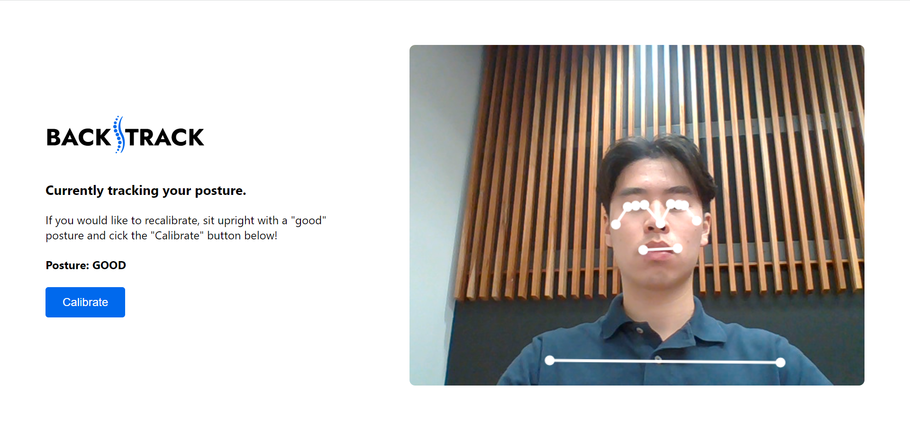
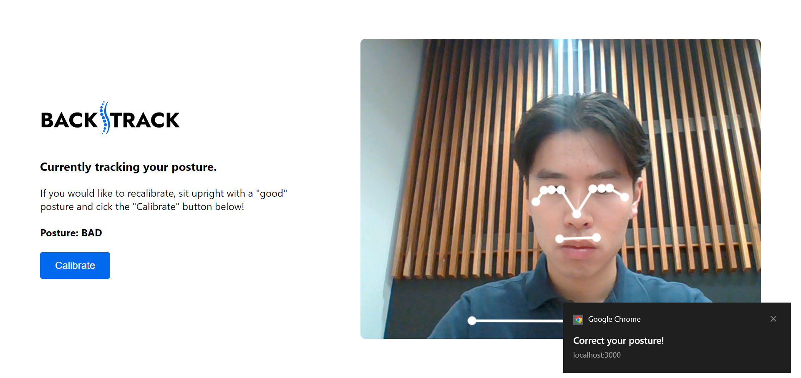

# BackTrack

A web app that tracks the user's posture in real-time and notifes them when they are slouching.

## Demo

See video demo [here](https://youtu.be/8nwTfgI1b7s).

When the user has good posture, nothing happens.

When the user has bad posture, they will recieve a notification in the browser.

## About the app

This app was developed using React and [MediaPipe Pose](https://google.github.io/mediapipe/solutions/pose) (a human pose estimation model).

A react-webcam component takes in a live video feed from the user's webcam and passes each frame into the pose estimation model, which will identify 3D landmarks on the user's body. To use the app, the user sits with a "good" posture and clicks the *Calibrate* button, which will save the landmarks for their good posture. A "bad" posture notification is sent when the app detects a deviation between the current (live) posture and the "good" posture.

## To use the app

Clone the repositiory. Then, inside the project directory, run:

### `npm install`

Installs the project dependencies.

### `npm run start`

Runs the app. Open [http://localhost:3000](http://localhost:3000) to view it in your browser.